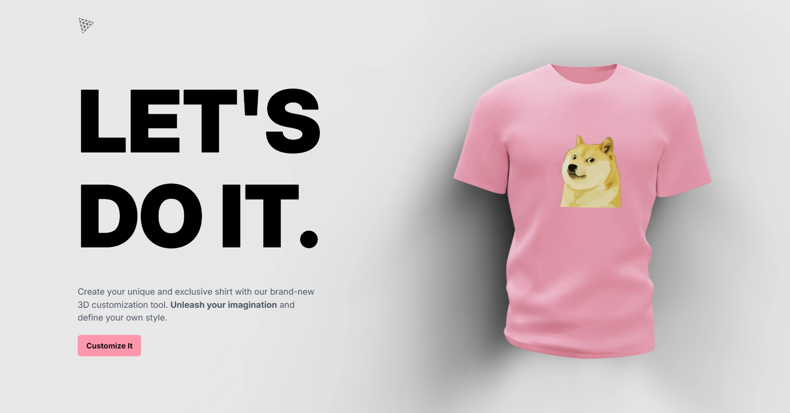

<div align="center">
    <a href="https://3d-tshirts-fv.netlify.app" target="_blank">
      
    </a>
  <h3 align="center">AI 3D T-Shirts</h3>
</div>

##  <br /> 📋 <a name="table">Table of Contents</a>

- ✨ [Introduction](#introduction)
- ⚙️ [Tech Stack](#tech-stack)
- 📝 [Features](#features)
- 🚀 [Quick Start](#quick-start)

##  <br /> <a name="introduction">✨ Introduction</a>

**[EN]** Create your own style with this 3D Customization App. Pick colors, add logos, and try AI designs to make your virtual swag unique. Built using React.js, Three.js, and OpenAI.

**[FR]** Créez votre propre style avec cette application de personnalisation 3D. Choisissez vos couleurs, ajoutez des logos et essayez des designs IA pour rendre votre style virtuel unique. Réalisée avec React.js, Three.js et OpenAI.

##  <br /> <a name="tech-stack">⚙️ Tech Stack</a>

- **React** is a popular JavaScript library for building user interfaces, particularly single-page applications where data changes over time. React's component-based architecture allows developers to create reusable UI components, making development more efficient and the codebase easier to maintain. 

- **MongoDB** is a NoSQL database system known for its flexibility and scalability, ideal for handling large volumes of unstructured or semi-structured data. It stores data in JSON-like documents, making it easy to integrate with modern applications. MongoDB's features include powerful querying capabilities, automatic sharding for horizontal scaling, flexible data models, and support for distributed transactions in recent versions.

- **Three.js** is a JavaScript library that enables the creation and display of 3D computer graphics in web browsers using WebGL. It provides extensive capabilities for rendering 3D scenes, including support for geometries, materials, lighting, and animations.

- **Three Fiber** is a React binding to Three.js, enabling declarative 3D rendering in the browser using React components. It simplifies the creation of complex 3D scenes and animations by providing a React-friendly API for Three.js functionalities.

- **Three Drei** is a collection of useful helpers and components for React Three Fiber. It includes abstractions for common Three.js patterns, such as lights, controls, and effects, making it easier to build sophisticated 3D applications with React and Three.js.

- **Framer Motion** is a React animation library designed for creating smooth, interactive animations and transitions. It simplifies complex animations with a straightforward API, supports gesture-based interactions, and offers physics-based animations for realistic motion effects.

- **Tailwind** is a utility-first CSS framework that speeds up UI development by providing a set of pre-built utility classes. It allows developers to quickly build custom designs without writing traditional CSS, promoting rapid prototyping and design consistency.

- **Vite** is a modern build tool that focuses on fast development and optimized production builds. It serves as a lightning-fast frontend build tool that supports React, Vue, and TypeScript out of the box. Vite leverages native ES module imports to achieve instant hot module replacement (HMR) and fast cold starts.

- **Node.js** is a server-side JavaScript runtime built on Chrome's V8 JavaScript engine. It allows developers to build scalable and efficient network applications using JavaScript. Node.js is commonly used for building APIs and server-side applications.

- **Express.js** is a minimal and flexible Node.js web application framework that provides a robust set of features for building web and mobile applications. It simplifies the process of creating powerful APIs and web servers with middleware and routing.

- **OpenAI API** provides access to powerful artificial intelligence models developed by OpenAI. It allows developers to integrate cutting-edge natural language processing (NLP) capabilities, such as text generation and sentiment analysis, into their applications.


## <br/> <a name="features">📝 Features</a>

👉 **3D Swag Generation**: Generate unique 3D shirts/swag items dynamically.

👉 **Color Customization**: Apply any color to the 3D shirt/swag for personalized styling.

👉 **Logo Upload Functionality**: Enable users to upload any file as a logo, integrating it seamlessly onto the 3D shirt.

👉 **Texture Image Upload**: Allow users to upload texture images to style the 3D shirt.

👉 **AI-Generated Logo Integration**: Utilize AI to generate logos and intelligently apply them to the 3D shirt.

👉 **AI-Generated Textures**: Implement AI-generated textures for enhanced 3D shirt customization.

👉 **Download Options**:Dynamically change the application theme based on the selected color, enhancing user experience.

👉 **Theme Change with Color Selection**: Dynamically change the application theme based on the selected color, enhancing user experience

👉 **Responsive 3D Application**: Ensure the application is responsive, delivering a seamless experience across various devices.

👉 **Framer Motion Animation**: Implement framer motion animations for smooth transitions between different 3D models.

## <br /> <a name="quick-start">🚀 Quick Start</a>

Follow these steps to set up the project locally on your machine.

<br/>**Prerequisites**

Make sure you have the following installed on your machine:

- [Git](https://git-scm.com/)
- [Node.js](https://nodejs.org/en)
- [npm](https://www.npmjs.com/) (Node Package Manager)

<br/>**Cloning the Repository**

```bash
git clone {git remote URL}
```

<br/>**Installation**

Let's install the project dependencies, from your terminal, run:

```bash
npm install
# or
yarn install
```

<br/>**Set Up Environment Variables**

Create a new file named `.env` in the root of your project and add the following content:

```env
OPENAI_API_KEY=
```

Replace the placeholder values with your actual respective account credentials:

- [OpenAI](https://platform.openai.com)


<br/>**Running the Project**

Installation will take a minute or two, but once that's done, you should be able to run the following command:

```bash
npm run dev
# or
yarn dev
```

Open [`http://localhost:3000`](http://localhost:3000) in your browser to view the project.